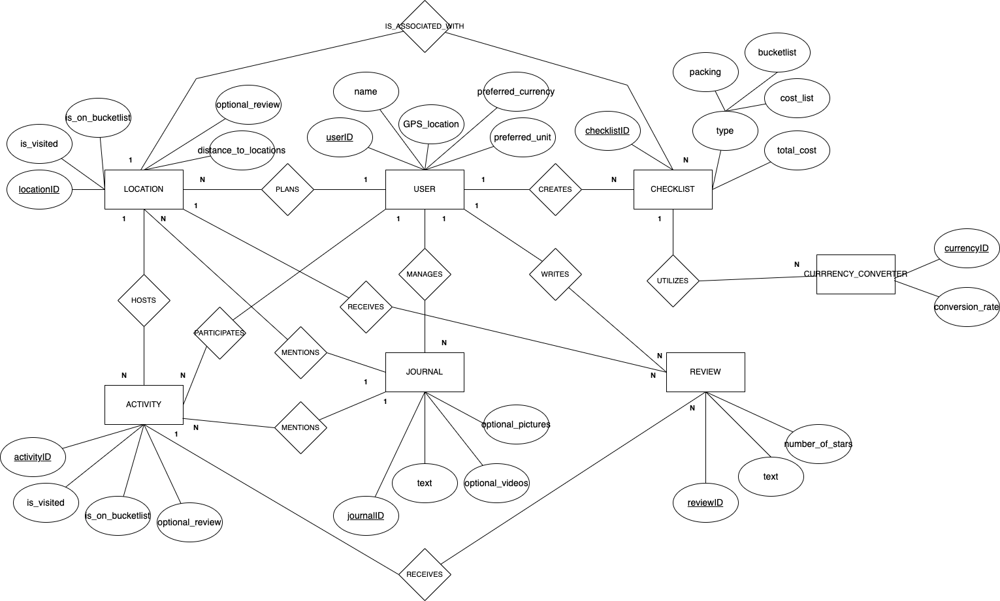
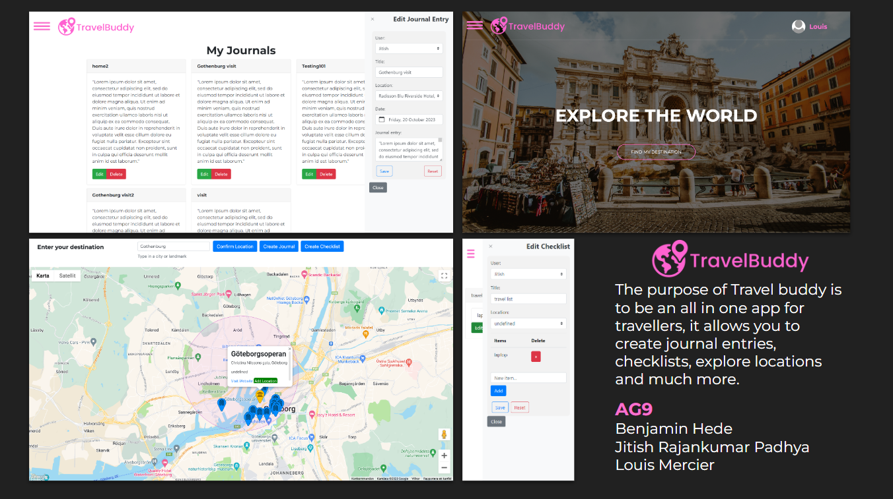

# Backend and Frontend Template

Latest version: https://git.chalmers.se/courses/dit342/2023/group-09-web

This template refers to itself as `group-00-web`. In your project, use your group number in place of `00`.

## Project Structure

| File        | Purpose           | What you do?  |
| ------------- | ------------- | ----- |
| `server/` | Backend server code | All your server code |
| [server/README.md](server/README.md) | Everything about the server | **READ ME** carefully! |
| `client/` | Frontend client code | All your client code |
| [client/README.md](client/README.md) | Everything about the client | **READ ME** carefully! |
| [docs/DEPLOYMENT.md](docs/DEPLOYMENT.md) | Free online production deployment | Deploy your app online in production mode |
| [docs/LOCAL_DEPLOYMENT.md](docs/LOCAL_DEPLOYMENT.md) | Local production deployment | Deploy your app local in production mode |

## Requirements

The version numbers in brackets indicate the tested versions but feel free to use more recent versions.
You can also use alternative tools if you know how to configure them (e.g., Firefox instead of Chrome).

* [Git](https://git-scm.com/) (v2) => [installation instructions](https://www.atlassian.com/git/tutorials/install-git)
  * [Add your Git username and set your email](https://docs.gitlab.com/ce/gitlab-basics/start-using-git.html#add-your-git-username-and-set-your-email)
    * `git config --global user.name "YOUR_USERNAME"` => check `git config --global user.name`
    * `git config --global user.email "email@example.com"` => check `git config --global user.email`
  * > **Windows users**: We recommend to use the [Git Bash](https://www.atlassian.com/git/tutorials/git-bash) shell from your Git installation or the Bash shell from the [Windows Subsystem for Linux](https://docs.microsoft.com/en-us/windows/wsl/install-win10) to run all shell commands for this project.
* [Chalmers GitLab](https://git.chalmers.se/) => Login with your **Chalmers CID** choosing "Sign in with" **Chalmers Login**. (contact [support@chalmers.se](mailto:support@chalmers.se) if you don't have one)
  * DIT342 course group: https://git.chalmers.se/courses/dit342
  * [Setup SSH key with Gitlab](https://docs.gitlab.com/ee/ssh/)
    * Create an SSH key pair `ssh-keygen -t ed25519 -C "email@example.com"` (skip if you already have one)
    * Add your public SSH key to your Gitlab profile under https://git.chalmers.se/profile/keys
    * Make sure the email you use to commit is registered under https://git.chalmers.se/profile/emails
  * Checkout the [Backend-Frontend](https://git.chalmers.se/courses/dit342/group-00-web) template `git clone git@git.chalmers.se:courses/dit342/2023/group-09-web.git`
* [Server Requirements](./server/README.md#Requirements)
* [Client Requirements](./client/README.md#Requirements)

## Getting started

```bash
# Clone repository
git clone git@git.chalmers.se:courses/dit342/2023/group-09-web.git

# Change into the directory
cd group-00-web

# Setup backend
cd server && npm install
npm run dev

# Setup frontend
cd client && npm install
npm run serve
```

> Check out the detailed instructions for [backend](./server/README.md) and [frontend](./client/README.md).

## Visual Studio Code (VSCode)

Open the `server` and `client` in separate VSCode workspaces or open the combined [backend-frontend.code-workspace](./backend-frontend.code-workspace). Otherwise, workspace-specific settings don't work properly.

## System Definition (MS0)

### Purpose

The travel companion is an app that helps you plan, track your travels, and create lifetime memories of each trip. The web based app creates an all in one package of important features to make your trip smooth sailing and unforgettable. You can list your visited destinations, create destination bucket lists, and plan your trips and expenses.

### Features

* Destination map and planner (chaining to a path to plan roundtrip: "travel via")
* Journal/notes: simple text-based + images (write about a trip while being able to add pics and vids)
* Checklists: 
  * Packing lists:
    * general
    * specific, like “I should bring my camera to the museum” connected to museum destination/activity
  * Bucket lists:
    * Destinations
    * Activities
  * Expenses lists:
    * Travel expenses, including calculation of sum and currency converter
* Reviews of destinations and activities

### Pages

* Main page containing a map for searching and/or saving possible destinations, activities, and chaining paths. Clicking on the map brings up a menu containing options like “Save to destination bucketlist” or “Save to visited”
* Left Sidebar Menu containing entries for Journal, Locations, Activities, Checklists, User preferences etc
* Right Sidebar Menu for additional details and options of location/list/note, pops up when location/list/note is selected
* Page for Journal with access to checklists, destinations
* User page for gps location, with saved preferences and with access to saved checklist, locations and quick access to journal. 


### Entity-Relationship (ER) Diagram



## Teaser (MS3)


